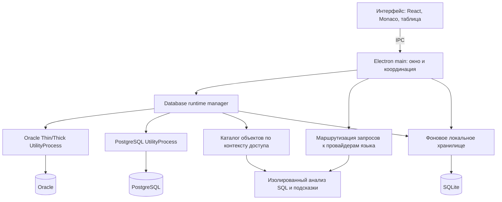

# Архитектура: SQLExplorer

Актуальный статус будущих работ определяется [единым бэклогом](backlog.md); этот документ сохраняет архитектурные решения и исходный план.

Дата: 2026-09-09. Актуализировано: 2026-09-11. Версия документа: 0.2. Статус: базовая архитектура реализована; детализация профилей, runtime и файлов находится в [плане базовых рабочих сценариев](core-workflows-development-plan.md).

Документ фиксирует требования из обсуждения и рабочие проектные решения. Движок автодополнения и совместимость с конкретными версиями серверов остаются открытыми. Каталог объектов и контекст автодополнения зафиксированы в [отдельном документе](autocompletion-architecture.md); кандидаты движков и корпус оценки — в [обзоре автодополнения](autocompletion.md), проверки отзывчивости — в [плане измерений](performance.md).

## Цель и критерии успеха

Создать удобный настольный SQL-клиент для Oracle и PostgreSQL с вкладками, соединениями, редактором, автодополнением и таблицей результатов. Ориентир по рабочим сценариям — PL/SQL Developer; полное воспроизведение всех его возможностей в MVP не требуется.

Главный сценарий производительности: пользователь разворачивает главное окно после сворачивания, имея много открытых документов. Предполагаемая причина зависания существующего инструмента — массовая перерисовка внутренних рабочих окон. Причина не подтверждена профилированием. RDP помог выявить сценарий и не считается самостоятельной причиной проблемы.

Критерии успеха:

- Стоимость восстановления окна определяется преимущественно видимым содержимым, а не количеством скрытых редакторов и таблиц.
- Во время подключения, выполнения SQL, загрузки данных и анализа текста интерфейс принимает ввод.
- Oracle и PostgreSQL доступны одновременно; контексты, сессии и подсказки разных вкладок не смешиваются.
- Большая выборка не требует загрузки всего результата в память.
- Черновики и расположение вкладок восстанавливаются после перезапуска.
- Транзакции и отмена запроса имеют понятное состояние; приложение не повторяет SQL автоматически после потери соединения.

Ускорение выполнения SQL на сервере не является гарантией архитектуры клиента. Отдельно измеряются отклик приложения, время запроса и получение результатов.

## Ограничения и допущения

### Зафиксированные требования

Кроссплатформенность, современный интерфейс и поддержка Oracle и PostgreSQL являются требованиями пользователя. Нужны базовые ежедневные сценарии: соединения, вкладки, редактирование SQL, выполнение запросов, результаты и автодополнение.

### Рабочие допущения

- Целевые семейства ОС — Windows, Linux и macOS. Минимальные версии, дистрибутивы Linux и поддерживаемые CPU уточняются отдельно.
- Приложение работает локально и подключается непосредственно к БД. Для базовых функций отдельный сервер SQLExplorer не нужен.
- Основной способ авторизации для MVP — учётная запись БД. Конкретные требования к TLS, TNS, wallet, SSH и корпоративной авторизации пока неизвестны.
- Профиль подключения, открытый документ и физическая сессия БД — разные сущности.
- Функциональное равенство Oracle и PostgreSQL означает одинаковые базовые рабочие сценарии, с сохранением особенностей каждой СУБД.

### Состав первой версии

| Область | Объём |
|---|---|
| Соединения | Сохранённые профили, проверка подключения, несколько активных соединений, обозначение БД во вкладке |
| Вкладки | SQL-файлы и черновики, перестановка, восстановление текста и положения курсора, разделение рабочей области |
| Редактор | Подсветка, поиск и замена, история отмены, горячие клавиши, запуск выделения или текущего выражения |
| Выполнение | Параметры, SQL и процедурные блоки как единицы выполнения, отмена, ошибки, Commit/Rollback |
| Результаты | Виртуализированная таблица, подгрузка порциями, копирование, экспорт CSV, просмотр больших значений по запросу |
| Объекты | Поиск схем и объектов, таблицы, представления, колонки, просмотр исходников программных объектов |
| Автодополнение | Ключевые слова, схемы, таблицы и колонки; контекст алиасов и обычных SQL-запросов |
| Локальное состояние | История SQL, настройки, профили, восстановление черновиков |

Глубина подсказок внутри PL/SQL и PL/pgSQL, редактирование и компиляция программных объектов, вывод DBMS_OUTPUT и расширенные bind-типы требуют отдельного определения. Выполнение явно выбранного процедурного блока не означает наличие полноценного семантического анализа его тела.

Отладчик, профилировщик процедур, визуальный конструктор запросов, DBA-инструменты, перенос SQL между диалектами, AI-функции и универсальное редактирование данных произвольного SELECT не входят в базовый MVP.

## Выбранное решение

### Стек

| Слой | Рабочий выбор | Причина |
|---|---|---|
| Desktop | Electron | Кроссплатформенная оболочка и поставка контролируемой версии Chromium |
| Интерфейс | React + TypeScript | Вкладки, панели и общая модель интерфейса |
| Редактор | Monaco Editor | Разделение документа и визуального редактора, готовые механизмы редактирования и провайдеров подсказок |
| Результаты | react-data-grid | Виртуализация строк и колонок, навигация с клавиатуры |
| Oracle | node-oracledb | Драйвер Oracle с Thin/Thick-режимами |
| PostgreSQL | pg + pg-cursor | Управление соединениями и порционное чтение результатов |
| Локальное хранение | SQLite | История, настройки, профили и каталог объектов |
| Автодополнение | Собственный каталог + заменяемый анализатор контекста | Каталог и контекст — [отдельное решение](autocompletion-architecture.md); движок оценивается на корпусе |

Версии библиотек и сборочный инструментарий здесь не закрепляются. Они выбираются совместимым набором перед реализацией. Electron увеличивает размер поставки и базовые расходы памяти; выигрыша по памяти относительно PL/SQL Developer пока не заявлено.

### Компоненты и связи

Это схема ответственности. Реализация использует runtime manager и отдельные ОС-процессы: один PostgreSQL, один Oracle Thin и по одному Oracle Thick на уникальную пару Oracle Client/Oracle Net configuration. Процесс не создаётся на каждую вкладку; отдельными являются физические соединения внутри соответствующего runtime.

Renderer отвечает за видимую рабочую область. Main управляет жизненным циклом окна, системными действиями, профилями, файлами и IPC. UtilityProcess владеют соединениями, транзакциями и курсорами. Провайдер языка получает текст и сведения о схеме, а не выполняет пользовательский SQL.

### Документы и отображение

У документа отдельно хранятся текстовая модель, история отмены, привязка к соединению и состояние просмотра. Monaco уже разделяет модели и редакторы. На каждую видимую область создаётся один редактор; переключение вкладки подключает соответствующую модель и восстанавливает курсор, выделение и прокрутку. [Модель Monaco](https://github.com/microsoft/monaco-editor#concepts).

Скрытые вкладки не держат смонтированные редакторы и таблицы и не участвуют в пересчёте размеров рабочей области. Скрытие компонентов без прекращения их обновлений не считается достаточным решением. Подписки интерфейса относятся к активным представлениям; стоимость изменения одной вкладки не должна включать обновление содержимого всех остальных.

React хранит структуру рабочей области и небольшие состояния интерфейса. Текст SQL остаётся в модели Monaco. Большие результаты обслуживаются отдельной моделью данных, передающей таблице ограниченный объём для отображения.

Подключения и настройки размещаются на страницах или в панелях. Ошибки SQL отображаются у соответствующего результата. Обычные рабочие операции не создают отдельные системные окна для каждого документа. Светлая и тёмная темы, компактная компоновка, палитра команд и цветовые метки соединений являются направлением дизайна. Компоновка и предложенное поведение показаны в [макете рабочего экрана](workspace-design.md); макет находится на обсуждении и не является реализацией приложения.

Контекст проводника объектов и соединение SQL-документа разделены. Выбор профиля в проводнике меняет список объектов и контекст создания нового документа. Он не меняет соединение уже открытой вкладки. Переключение SQL-вкладки показывает её соединение рядом с выполнением и может синхронизировать проводник с ним.

### Основные сущности

| Сущность | Назначение |
|---|---|
| ConnectionProfile | Сохранённые параметры подключения и ссылка на секрет |
| Session | Физическое соединение, контекст СУБД, состояние транзакции и выполняемая команда |
| SqlDocument | Текстовая модель, диалект, связь с профилем/сессией, состояние просмотра |
| EditorPane | Видимая область, отображающая один документ |
| Execution | Снимок запуска: документ, сессия, текст, параметры, идентификатор и состояние |
| ResultSet | Колонки, полученные порции строк, состояние курсора и признак неполной загрузки |
| Catalog | Индексированный каталог объектов и контекста доступа для подсказок и Explorer |

### Сессии, транзакции и выполнение

Физическая сессия открывается по необходимости и закрепляется за рабочей вкладкой. Одновременно в одной сессии выполняется одна пользовательская команда. Между вкладками возможна параллельная работа в пределах лимитов соединений. Профили и текстовые вкладки не открывают по соединению автоматически при восстановлении приложения.

Команды одной транзакции используют одну сессию. Это прямо требуется и для [node-postgres](https://node-postgres.com/features/transactions). В первой версии общее использование одной транзакции несколькими вкладками не предусматривается.

Режим автокоммита виден в интерфейсе; предлагаемый начальный режим — ручное управление транзакциями. Адаптер учитывает нативное поведение СУБД, явно введённые команды управления транзакцией и команды, которые нельзя выполнять внутри транзакции. Commit/Rollback не обещают откат любого действия: например, Oracle выполняет неявный commit вокруг DDL. [Документация Oracle](https://docs.oracle.com/en/database/oracle/oracle-database/19/tdddg/data-definition-language-ddl-statements.html).

Запуск захватывает контекст выбранной вкладки. Результат прикрепляется по идентификатору Execution, даже если пользователь успел переключиться в другой документ. Поток состояний включает ожидание, выполнение, получение строк, запрос отмены и окончательный исход. Запрос отмены не означает, что сервер уже остановил команду.

Отмена активного SQL и прекращение дальнейшего чтения курсора — отдельные операции адаптера. После обрыва соединения состояние показывается как потерянное или неизвестное до выяснения. Автоматическое повторное выполнение SQL и скрытое восстановление транзакции исключены. Сбой одного runtime-процесса переводит принадлежащие ему вкладки в `lost`; другие runtime и тексты документов от него не зависят.

Для метаданных используется отдельное служебное соединение с тем же контекстом доступа, чтобы длинный пользовательский запрос не удерживал очередь автодополнения. Смена схемы, роли или search_path требует обновления контекста, передаваемого провайдеру.

### Адаптеры Oracle и PostgreSQL

Общий контракт описывает подключение, выполнение, отмену, чтение следующей порции, закрытие курсора, управление транзакцией и получение метаданных. Адаптер также сообщает поддерживаемые возможности и нативные типы.

Диалект определяет синтаксис параметров, границы выражений, правила имён и анализ процедурных блоков. Деление скрипта по каждому символу точки с запятой недопустимо. В частности, [dollar-quoted строки PostgreSQL](https://www.postgresql.org/docs/current/sql-syntax-lexical.html#SQL-SYNTAX-DOLLAR-QUOTING) могут содержать тело функции с внутренними разделителями. Полная совместимость с командами SQL*Plus и psql в MVP не обещается.

Дерево объектов сохраняет особенности СУБД: пакеты и синонимы Oracle; функции, процедуры и типы PostgreSQL. Поиск объектов PostgreSQL учитывает [search_path](https://www.postgresql.org/docs/current/ddl-schemas.html#DDL-SCHEMAS-PATH), а не только схему public.

### Результаты и память

Запрос выполняется один раз. Дальнейшие порции читаются из того же курсора; приложение не переписывает пользовательский SQL для искусственной пагинации. [pg-cursor](https://node-postgres.com/apis/cursor) поддерживает такой способ чтения.

Первоначально предлагается получать 200–500 строк, затем подгружать по запросу. Виртуализация отображения дополняется отдельным ограничением кэша данных. Для MVP простая политика при достижении бюджета — остановить подгрузку и предложить потоковый экспорт. Интерактивная подкачка всего результата на диск может быть добавлена отдельно.

Колонки идентифицируются позицией, чтобы одинаковые имена не перезаписывали друг друга. Передаваемые значения сохраняют NULL, исходный тип, точность чисел и даты. Нельзя безусловно преобразовывать все числовые значения в JavaScript Number, а все даты — в Date: стандартное преобразование дат node-postgres, например, теряет микросекунды. [Типы node-postgres](https://node-postgres.com/features/types).

Большие текстовые и бинарные значения загружаются отдельно. Локальная сортировка и фильтрация явно относятся к загруженной части результата; неполную выборку нельзя выдавать за полный набор. Экспорт не накапливает весь результат в renderer. Если для операции потребуется новое выполнение SQL, это должно быть отдельным явным действием.

### Автодополнение и локальное состояние

Общий интерфейс провайдера скрывает выбор движка. Запрос содержит диалект, версию документа, позицию и контекст соединения. Устаревший ответ отбрасывается. Подсказки строятся на индексированном каталоге объектов, полный снимок в renderer не передаётся; колонки загружаются по мере обращения. Обработка большого SQL ограничена по времени и не блокирует ввод. Детали — в [архитектуре каталога](autocompletion-architecture.md), источники и корпус — в [autocompletion.md](autocompletion.md).

SQLite хранит историю, настройки, профили и метаданные. Сохранённые пароли обслуживаются через защищённое системное хранилище; открытого хранения паролей в профилях и журналах не предусматривается. Результаты запросов не становятся постоянным архивом автоматически.

Восстановление рабочей области возвращает текст, расположение вкладок, привязки к профилям и положение курсора. Оно не восстанавливает живые серверные транзакции и курсоры. История отмены сохраняется в модели при переключении вкладок; её перенос через перезапуск приложения в MVP не обещается.

## Ключевые решения и их обоснование

| Решение | Альтернатива | Обоснование |
|---|---|---|
| Общая оболочка с адаптерами двух СУБД | Реализовать Oracle, затем переделывать для PostgreSQL | Обе СУБД нужны в первой версии |
| Видимые представления отделены от документов | Постоянный редактор и grid на каждую вкладку | Основное требование к восстановлению окна |
| Electron + Monaco | Tauri или Avalonia | Готовая редакторская инфраструктура и единая поставляемая версия движка |
| SQL и анализ текста выполняются вне UI | Работа в renderer/main | Отзывчивость при сетевых и вычислительных задержках |
| Закреплённая сессия вкладки | Случайное соединение из пула для каждого запроса | Сохранение транзакции и контекста пользователя |
| Курсор и ограниченный кэш | Полная загрузка выборки | Ограничение памяти и быстрый первый результат |
| Заменяемые языковые провайдеры | Жёсткая связь редактора с одним парсером | Качество готовых движков ещё не подтверждено |

## Отклонённые альтернативы и причины

- **WPF** исключён из-за требования кроссплатформенности.
- **Tauri + Monaco** остаётся возможной альтернативой, но для того же node-oracledb потребуется отдельная поставка Node-компонента; системные webview отличаются между ОС. Меньший размер дистрибутива сам по себе не подтверждает более быструю отрисовку. [Tauri](https://v2.tauri.app/reference/webview-versions/), [Node sidecar](https://v2.tauri.app/learn/sidecar-nodejs/).
- **Avalonia + AvaloniaEdit** не выбрана для базового варианта: по текущей оценке больше работы уйдёт на доведение редактора и таблицы. Это проектная оценка, а не результат сравнительного бенчмарка.
- **Специальный режим RDP как основное решение** исключён из требований. Проверяем восстановление окна и работу скрытых документов.
- **Собственный полный движок автодополнения с нуля** не является исходным планом: сначала оцениваются готовые компоненты.

## Риски и открытые вопросы

| Вопрос | Последствие |
|---|---|
| Минимальные версии Oracle и PostgreSQL | Выбор драйверов, режимов подключения и диалектных возможностей |
| ОС, дистрибутивы и CPU | Набор установочных пакетов и проверок нативных зависимостей |
| Способы авторизации и маршруты подключения | Объём поддержки TNS, wallet, сертификатов, SSH и SSO |
| Глубина PL/SQL и PL/pgSQL | Состав семантического анализа и редактора программных объектов |
| Типичная нагрузка: документы, схемы, результаты | Настройка бюджетов и представительного корпуса измерений |
| Пригодность Bytebase | Возможность выделения модуля, зависимости, полнота и скорость |
| Базовые расходы Electron | Проверка запуска, памяти и восстановления на целевых машинах |
| Несколько UtilityProcess | Дополнительная память; взамен Thin/Thick совместимы одновременно и сбой изолирован по runtime key |

Для node-oracledb Thin заявлено подключение к Oracle 12.1+, а для 11.2 возможен Thick с подходящим Oracle Client. Это ограничение кандидата в драйверы, а не уже утверждённая матрица SQLExplorer. [Совместимость](https://node-oracledb.readthedocs.io/en/stable/user_guide/installation.html#supported-oracle-database-versions).

## План реализации

До окончательной детализации взаимодействия редактора, соединений, подсказок и результатов проводится [практическое изучение установленного PL/SQL Developer 17](plsql-developer-review.md). Оно является частью проектирования и дополняет чтение руководства. Статус каждого проверенного сценария фиксируется отдельно.

План применяется после отдельного перехода к реализации; текущие артефакты фиксируют проектирование.

1. Проверить основу интерфейса: отдельные модели документов, ограниченное число представлений, восстановление окна с 1/20/100 документами.
2. Реализовать каталог и контекст автодополнения ([этап 1](autocompletion-architecture.md)), затем оценить готовые движки на общем корпусе и зафиксировать выбор (этап 2).
3. Реализовать профили, DB-worker и адаптеры обеих СУБД; проверить подключения, закреплённые сессии и отмену.
4. Добавить порционную выдачу, отображение типов без потерь, бюджет памяти и экспорт.
5. Подключить дерево объектов, каталог и провайдеры подсказок.
6. Добавить сохранение черновиков, историю, восстановление и оформление интерфейса.
7. Проверить реальные сценарии на согласованных версиях серверов и ОС, включая повторное восстановление окна под нагрузкой.

На каждом этапе проверяются соответствующие риски. Заявлять устранение исходной проблемы можно после измерений по [performance.md](performance.md).
