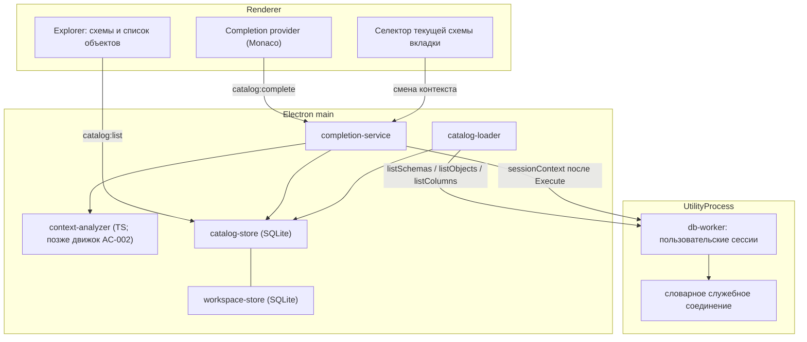

# Архитектура: каталог метаданных и контекстное автодополнение (AC-001, AC-002)

Дата: 2026-09-12. Статус: этап 1 (AC-001 и Explorer) реализован и проверен; этап 2 (AC-002) открыт: корпус собран, PostgreSQL-кандидат `omni` прогнан, Oracle и Rust-кандидаты ожидают прогона — [отчёт об оценке](autocompletion-engine-evaluation.md).

Связанные документы: [единый бэклог](backlog.md) (AC-001, AC-002, OBJ-001), [исследование автодополнения](autocompletion.md) (кандидаты движков и корпус), [архитектура](architecture.md) (инварианты), [производительность](performance.md) (бюджеты отклика).

Документ фиксирует итоги обсуждения 2026-09-12: каталог объектов, контекст доступа, поведение подсказок и порядок оценки промышленного движка. Выбор движка остаётся открытым до этапа 2.

## Цель и критерии успеха

Цель — сделать подсказки пригодными на реальных производственных БД, включая БД прикладного пользователя с примерно 200 тыс. доступных объектов, и подготовить основу для выбора промышленного движка.

Критерии успеха:

- Ввод не блокируется: каталог и метаданные не загружаются полным снимком в renderer; при наборе интерфейс отзывчив.
- Из прогретого каталога подсказки появляются в бюджете P95 ≤ 150 мс от действия пользователя ([performance.md](performance.md)); холодный путь не блокирует редактор и показывает признак неполноты.
- Без квалификатора предлагаются объекты текущей схемы: Oracle — `CURRENT_SCHEMA`; PostgreSQL — по порядку `search_path`. С квалификатором `схема.`, включая `sys.`, — объекты указанной схемы. Квалификатор, равный `user` или имени пользователя, резолвится в текущую схему.
- Oracle: доступные PUBLIC синонимы предлагаются и без квалификатора, с видом `synonym`.
- Права учитываются как видимость: недоступные объекты и колонки не собираются и не предлагаются.
- Смена пользователя, схемы, `search_path` или профиля инвалидирует контекст; подсказки не переносятся между соединениями и версиями текста.
- Explorer не получает полный снимок: схемы, объекты и поиск работают постранично из каталога.
- Сценарии корпуса из [autocompletion.md](autocompletion.md) проходят на Oracle 21c XE и PostgreSQL 10.23, включая одноимённые объекты в разных схемах и разные права.

Отдельный критерий AC-002: на этапе 2 зафиксировано решение по движку (выбран или осознанно отклонён) с отчётом по корпусу, лицензиям, зависимостям и бюджетам анализа.

## Ограничения и допущения

- Масштаб: у прикладного пользователя одной из целевых БД около 200 тыс. объектов; полный снимок, полная предзагрузка всех схем и передача всех объектов в renderer недопустимы.
- «Права» в этой задаче означают видимость словаря (`ALL_*`, `information_schema`, `has_*_privilege`), а не полную модель привилегий с ролями и признаками доступности в подсказке. Полная модель может быть добавлена отдельно.
- Метаданные и словарные запросы идут через отдельное служебное соединение с тем же контекстом доступа ([architecture.md](architecture.md)); оно не владеет транзакцией вкладки и не запускает пользовательский SQL.
- Провайдер подсказок не выполняет SQL пользователя и не создаёт объектов в БД; автоматический `EXPLAIN` и серверная проверка SQL остаются вне объёма ([backlog.md](backlog.md)).
- Renderer изолирован (`sandbox`, `contextIsolation`), обмен — только через preload IPC.
- Тестовые стенды: Oracle 21c XE (Thin/Thick), PostgreSQL 10.23; приёмка на других версиях — по COMPAT-001.
- Вне объёма среза: дерево объектов и исходники программных объектов (OBJ-001), подсказки внутри PL/SQL/PL/pgSQL (AC-003), семантическая проверка SQL, история запросов, bind-параметры.

## Выбранное решение

### Компоненты

- `completion-service` — оркестрация запроса подсказок: вызов анализатора, запросы каталога, ранжирование, лимит, отбрасывание устаревших ответов.
- `context-analyzer` — тонкий интерфейс: по тексту и позиции возвращает квалификатор, префикс, диапазон замены и области видимости (алиасы, CTE). Этап 1 — собственная TS-реализация; этап 2 — сюда же может быть поставлен выбранный движок.
- `catalog-store` — SQLite-каталог и префиксные запросы; единственный источник кандидатов.
- `catalog-loader` — фоновое наполнение, порог по размеру схемы, очередь, отмена, инвалидация, публикация состояния.
- `db-worker` — существующий процесс: словарные запросы к Oracle/PostgreSQL и чтение фактического контекста сессии вкладки.
- Renderer: `completion-provider`, панель Explorer, селектор схемы. Полные модели метаданных в renderer не хранятся.

### Хранилище каталога

Каталог хранится в пользовательской SQLite-базе (workspace-store) отдельными таблицами; версия схемы workspace повышается миграцией.

- `catalog_context(connection_id PK, user_name, current_schema, search_path, profile_version, fetched_at)` — эффективный контекст доступа; ключ инвалидации.
- `catalog_schema(connection_id, name, is_default, object_count, loaded_at, stale, PK(connection_id, name))`.
- `catalog_object(connection_id, schema, name, kind, search_key, loaded_at, PK(connection_id, schema, name))`; индексы `(connection_id, search_key)` и `(connection_id, schema, search_key)`.
- `catalog_column(connection_id, schema, object, position, name, data_type, nullable, PK(connection_id, schema, object, position))` — заполняется только лениво по объекту.

`search_key`: Oracle — имена словаря в верхнем регистре; неквотированный ввод ищется без учёта регистра, quoted — точным совпадением. PostgreSQL — для неквотированного ввода сравнивается `lower(name)`, для quoted — точное имя.

Существующая таблица `metadata_cache` и передача `MetadataSnapshot` в bootstrap выводятся из обращения; устаревшие данные не переносятся.

### Контракты

- `CompletionRequest { documentId, version, connectionId, dialect, textWindow, cursorOffset }`; `textWindow` — текущий statement, выделенный тем же разбором, что и для Execute.
- `resolveContext(...) → { qualifier: {kind: 'schema'|'alias'|'object', name}, prefix, replaceRange, scope[] }`.
- `Candidate { text, kind, detail, replaceRange, sortText, incomplete }`; `CompletionResult { candidates, incomplete, source: 'cache'|'database' }`.
- IPC: `catalog:complete`, `catalog:list` (схемы/объекты, поиск, страница), `catalog:refresh`, событие `catalog:state` (прогресс и устаревание по соединению и схеме).
- Worker-методы: `listSchemas`, `listObjects {schema, prefix, limit, kinds}`, `listColumns {schema, object}`, `sessionContext` (на физической сессии вкладки).

### Потоки

**Подсказки при вводе.** Provider определяет позицию, версию документа и statement-окно → `catalog:complete` → анализатор резолвит алиас/схему/префикс → каталог отдаёт кандидатов из кэша; при промахе колонок — короткий запрос к БД в фоне, ответ помечается неполным → список ранжируется, ограничивается N = 200, возвращается с диапазоном замены. Ответ применяется, только если версия документа не изменилась; новые запросы вытесняют старые.

**Наполнение каталога (гибрид с порогом).** При подключении дёшево читаются список схем и контекст доступа. Схемы до порога (~20 тыс. объектов) загружаются фоном целиком; крупнее — остаются в режиме on-demand: префиксный запрос идёт в словарь БД с коротким таймаутом, результат кэшируется в SQLite. Колонки грузятся только по конкретному объекту. Загрузка не блокирует редактор; состояние видно в UI.

**Текущая схема.** Селектор вкладки задаёт схему явно (Oracle — `ALTER SESSION SET CURRENT_SCHEMA`, PostgreSQL — `SET search_path`); при отсутствии сессии предпочтение применяется при следующем подключении. После каждого Execute выполняется дешёвое чтение фактического контекста сессии; при расхождении контекст и затронутый каталог инвалидируются.

**Explorer.** Список схем и постраничный список объектов с поиском и фильтром по видам читаются из каталога (`catalog:list`); полный снимок не запрашивается и не хранится. Дерево, группировка по видам и исходники — OBJ-001.

### Поведение подсказок

- Без квалификатора: объекты текущей схемы; Oracle — плюс доступные PUBLIC синонимы. Для PostgreSQL порядок `search_path` сохраняется, одинаковые имена дедуплицируются по первой схеме.
- С квалификатором: объекты указанной схемы; `sys.` — её объекты; системные схемы не подмешиваются в неквалифицированный список.
- После алиаса или объекта: колонки только этого источника; при отсутствии в кэше — неполный ответ и фоновая догрузка.
- Ранжирование по умолчанию: локальные алиасы → объекты текущей схемы → PUBLIC синонимы → колонки → ключевые слова.
- Лимит N = 200; при большем числе совпадений ответ помечается неполным.

### Этап 2: выбор движка (AC-002)

Движок подключается только как `context-analyzer`; кандидатов всегда формирует каталог. Требования к движку — анализ текста и позиции, а не хранение метаданных.

1. Собрать исполнимый корпус из [autocompletion.md](autocompletion.md) на реальных стендах и зафиксировать базовую линию текущего TS-анализатора.
2. Проверить кандидатов: модули Bytebase (Oracle) и `omni` (PostgreSQL), при неудовлетворительном результате — Postgres Language Server или ANTLR/c3. Учитывать лицензию (MIT и enterprise-части Bytebase), размер зависимостей, изоляцию процесса, отмену устаревших запросов и предел времени анализа.
3. Зафиксировать решение и перенести отчёт в документы. Если выигрыша нет — остаётся собственная реализация, зафиксированная как осознанный выбор.

## Фактическая реализация и проверки (2026-09-12)

Реализовано: `src/main/catalog-store.ts`, `catalog-loader.ts`, `context-analyzer.ts`, `completion-service.ts`, `session-context.ts`; словарные методы в `db-worker.ts`; IPC `catalog:complete`/`catalog:list`/`catalog:refresh`/`catalog:context`/`catalog:set-schema` и событие `catalog:state-changed`; селектор схемы в `ExecutionToolbar`; Explorer на каталоге; bootstrap без снимка метаданных.

Проверки:

- ESLint и строгий TypeScript проходят; 65 модульных тестов в 9 файлах, включая каталог, анализатор контекста и completion (27 новых).
- Browser E2E: 7 сценариев, включая каталог схем, поиск объектов и смену текущей схемы.
- Electron E2E: 6 сценариев на живых БД.
- `npm run test:db`: Oracle 21c XE (Thin/Thick/SYSDBA) и PostgreSQL 10.23 — новая проверка словарей, PUBLIC синонимов, `SYS`, контекста и смены `search_path` вместе с прежними сценариями (пейджинг, откат, отмена, reconnect).
- Каталог 200 000 объектов: префиксный поиск через SQLite-индекс проверяется модульным тестом с бюджетом 500 мс (фактически миллисекунды).

Ограничения проверки: живой сценарий одноимённых объектов в разных схемах требует временных DDL-объектов и не выполнялся; изоляция схем покрыта юнит-тестами. Диапазон замены для символов вне BMP отдельно не измерялся.

## Ключевые решения и их обоснование

| Решение | Альтернативы | Почему выбрано |
|---|---|---|
| Индексированный каталог в main/SQLite, кандидаты — всегда из него | Полный снимок в renderer; метаданные в движке | 200 тыс. объектов не переживают renderer и полную передачу; каталог даёт префиксный поиск, лимиты и контроль прав |
| Гибридное наполнение с порогом на схему | Полная предзагрузка; чистый on-demand | Прогрев даёт мгновенные подсказки, порог не даёт одной огромной схеме заблокировать всё, on-demand не требует предзагрузки 200k |
| Движок — анализатор контекста, кандидаты наши | Движок как полный провайдер | Сохраняем контроль над лимитом, правами, кэшем и отменой; движок не диктует модель метаданных |
| Права = видимость | Полная модель привилегий | Совпадает со словарями `ALL_*` и privilege-фильтром, не тормозит выдачу; полная модель — отдельная задача |
| Селектор схемы + проверка контекста после Execute | Только пассивное отслеживание; фиксированная схема профиля | Явный UX и корректность после `ALTER SESSION`/`SET search_path` без перехвата произвольного SQL |
| Анализ по statement-окну с верхней границей размера | Анализ всего текста при каждом вводе | Ограничивает стоимость и объём IPC; покрывает алиасы, CTE и области видимости внутри выражения |
| Отбрасывание ответов по версии документа | Отмена процесса анализа | Просто и надёжно для Monaco; не требует синхронной отмены словарных запросов |
| Колонки только лениво по объекту | Предзагрузка колонок всех объектов | Колонки на 200k объектов — миллионы строк; ленивый путь даёт приемлемую память |

## Отклонённые альтернативы и причины

- **Полный `MetadataSnapshot` в renderer (текущая схема).** При 200k объектах вызывает зависание и непригоден для отображения.
- **Движок как единственный провайдер с полными метаданными.** Готовые движки не контролируют лимиты и порционность; интеграция словаря на 200k в их модель метаданных не проверена и рискует.
- **Чистый on-demand без фонового наполнения.** Каждый ввод требует сетевого запроса; при задержке БД бюджет P95 не выполняется.
- **Полная предзагрузка всех схем.** Долгая загрузка, большой расход памяти и диска; фоновая задача конкурирует с пользовательскими запросами.
- **Postgres Language Server как основной провайдер.** Покрывает только PostgreSQL, требует собственного соединения и кэша схемы, не решает задачу Oracle.
- **ANTLR/c3 как основа.** Больше собственной семантики и риски производительности на PL/SQL; остаётся резервом для Oracle.
- **Пассивное отслеживание схемы.** Пользователь не видит текущую схему и не может её сменить иначе как SQL-командой.
- **Фиксированная схема профиля.** Ломается после `ALTER SESSION`/`SET search_path`.

## Риски и открытые вопросы

- Порог 20 тыс. объектов — эмпирический: проверить на реальных стендах, при необходимости вынести в настройку.
- Живой сценарий одноимённых объектов в разных схемах не выполнялся: нужны временные DDL-объекты; до ручной приёмки изоляция подтверждена юнит-тестами.
- Стоимость префиксных словарных запросов на очень больших доступных наборах; при медленном ответе нужен понятный индикатор и повтор.
- Качество TS-анализатора на CTE, вложенных областях и quoted identifiers; объём первой версии фиксируется тестами, сложные случаи могут уйти на этап 2.
- Дедупликация и приоритеты имён PostgreSQL при нескольких схемах в `search_path`.
- PUBLIC синонимы Oracle могут указывать на недоступный объект: имя показывается, колонки недоступны.
- Изменения объектов вне приложения отслеживаются только ручным Refresh и признаком stale; автополлинг не вводится.
- Стоимость передачи statement-окна по IPC при очень больших выражениях; верхняя граница размера обязательна.
- Этап 2: лицензионная граница Bytebase (MIT отдельно от enterprise), размер Go/Rust-компонента, поведение при зависании, изоляция и таймауты.
- Миграция workspace: таблица `metadata_cache` удаляется при открытии пользовательской базы; большой старый кэш не влияет на профили и рабочую область (выполнено).

## План реализации

1. SQLite-схема каталога, `catalog-store`, миграция workspace и вывод `metadata_cache` из обращения; модульные тесты. — **Выполнено**: `src/main/catalog-store.ts`, `tests/catalog-store.test.ts`, workspace schemaVersion 3.
2. Словарные запросы `db-worker` для Oracle и PostgreSQL с учётом видимости; методы `listSchemas`, `listObjects`, `listColumns`, `sessionContext`. — **Выполнено**: Oracle `ALL_OBJECTS`/`ALL_SYNONYMS`, PostgreSQL `pg_class`/`pg_proc` с проверками привилегий, смена схемы сессии.
3. `catalog-loader`: порог, очередь, отмена, инвалидация, событие `catalog:state`. — **Выполнено**: `src/main/catalog-loader.ts`, порог 20 000, таймаут словарных запросов, инвалидация.
4. `context-analyzer` и переиспользование разбора statement; тесты на алиасы, квалификаторы, quoted identifiers и недописанный SQL. — **Выполнено**: `src/main/context-analyzer.ts`, `tests/context-analyzer.test.ts`, 12 сценариев.
5. `completion-service`, IPC `catalog:complete` и провайдер Monaco: ранжирование, лимит, версии, неполнота. — **Выполнено**: `src/main/completion-service.ts`, `src/renderer/editor/SqlEditor.tsx`, `tests/completion-service.test.ts`.
6. Селектор текущей схемы вкладки и проверка фактического контекста после Execute. — **Выполнено**: `ExecutionToolbar`, `sessionContext` после `db:execute`, `catalog:set-schema`.
7. Explorer на `catalog:list`: схемы, постраничные объекты, поиск; удаление снимка из bootstrap. — **Выполнено**: `Explorer.tsx`, `BootstrapPayload` без метаданных, browser E2E-сценарий каталога.
8. Интеграционные и E2E-проверки на Oracle/PostgreSQL: одноимённые объекты в разных схемах, разные права, PUBLIC синонимы, смена `search_path`; отдельная проверка каталога ~200k строк. — **Выполнено частично**: live self-test проверяет словари, PUBLIC синонимы, `SYS`, смену `search_path`; 200k-поиск проверен модульным тестом; сценарий одноимённых объектов в разных схемах требует временных DDL-объектов и остаётся для ручной приёмки.
9. Этап 2 (AC-002): корпус, прогон кандидатов, отчёт и решение; при выборе движка — подключение за `context-analyzer` без изменения каталога и UI. — **Не выполнено**: корпус и базовая линия зафиксированы в [отчёте](autocompletion-engine-evaluation.md); сборка кандидатов требует Go/Rust, которых нет в среде реализации.

Шаг 8 закрывает AC-001 (с оговоркой про живой сценарий одноимённых объектов); шаг 9 закрывает AC-002.
