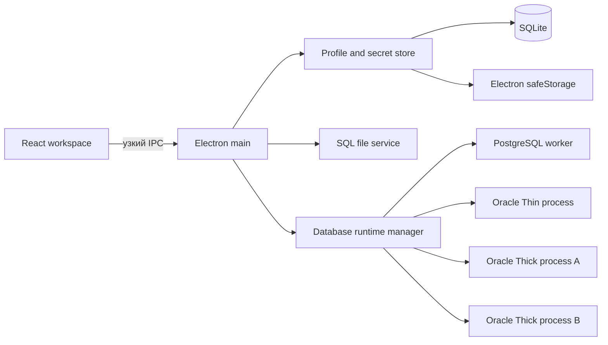

# Архитектура: базовые рабочие сценарии SQLExplorer

Дата: 2026-09-10. Реализовано и проверено: 2026-09-11. Статус: выполнено. Область: профили соединений, жизненный цикл сессий, создание SQL-вкладок и работа с SQL-файлами.

Этот документ фиксирует решения после практической оценки первого рабочего среза. Он является основным планом разработки перечисленных возможностей и дополняет общую [архитектуру SQLExplorer](architecture.md). Если общий документ расходится с этим планом в вопросах соединений, сессий или файлов, для следующего среза применяется этот план.

## Цель и критерии успеха

Следующий срез должен превратить демонстрационную рабочую область в минимально пригодный ежедневный SQL-клиент. Пользователь должен без редактирования локальных конфигурационных файлов создать соединение, однозначно увидеть состояние сессии активной вкладки, восстановить соединение после разрыва, выбрать соединение при создании вкладки, а также открыть и сохранить SQL-файл через видимый интерфейс.

Критерии успеха:

- Новое соединение создаётся, проверяется и редактируется из интерфейса приложения.
- Профиль, сохранённые реквизиты и физическая сессия представлены как разные сущности и не используют один общий индикатор состояния.
- Активная вкладка всегда показывает профиль, режим Oracle при его наличии, привилегию и фактическое последнее известное состояние собственной сессии.
- Oracle Thin и Thick могут использоваться одновременно в одном запуске приложения.
- Oracle поддерживает адресацию через host/port/service, TNS alias и произвольный connect string.
- Oracle поддерживает обычное парольное соединение и парольное соединение с привилегией SYSDBA.
- Каждая SQL-вкладка имеет отдельную физическую сессию и собственное состояние транзакции.
- В приложении нет периодического `ping()`, `SELECT 1` или другого прикладного heartbeat.
- Потерянная сессия удаляется из кэша; следующий явный запуск пользователя способен создать новую сессию.
- SQL, который мог быть отправлен серверу до разрыва, никогда не повторяется автоматически.
- Левый клик по кнопке новой вкладки использует текущий контекст, а правый клик и видимая стрелка показывают список соединений.
- Открытие и сохранение файлов доступны через видимые кнопки и меню; горячие клавиши являются дополнительным способом, а не единственным интерфейсом.
- SQL-файлы открываются и сохраняются с сохранением исходной кодировки, BOM и перевода строк, если пользователь явно не выбрал преобразование.
- Черновик можно открыть и редактировать без настроенного соединения.
- В рабочем интерфейсе не отображаются демонстрационные профили, метаданные или зелёные индикаторы, способные выглядеть как результат реального подключения.
- Все сценарии проходят в упакованной Windows-сборке; архитектура не должна исключать Linux и macOS.

## Ограничения и допущения

### Зафиксированные продуктовые решения

- Поддерживаются Oracle и PostgreSQL.
- Физическая сессия закреплена за SQL-документом, а не разделяется всеми вкладками профиля.
- Oracle Thin и Thick должны работать одновременно.
- Для Oracle в текущий объём входят host/port/service, TNS alias, произвольный connect string и SYSDBA.
- Wallet, специально настраиваемый TCPS и external authentication в текущий объём не входят.
- `tnsnames.ora` читается приложением, но никогда им не редактируется.
- Должны существовать глобальный каталог Oracle Net и переопределение каталога в отдельном профиле.
- Существующие SQL-файлы имеют разные кодировки; принудительная конвертация всех файлов в UTF-8 недопустима.
- Прикладной периодический ping запрещён.

### Технические ограничения

- Renderer остаётся изолированным: `sandbox: true`, `contextIsolation: true`, без Node integration.
- Пароли, файловые операции, драйверы и создание процессов остаются в main/служебных процессах и не становятся доступными renderer напрямую.
- Пароль не возвращается в renderer после сохранения и не попадает в BootstrapPayload, логи, исключения или снимок рабочей области.
- `node-oracledb` может работать только в одном режиме, Thin или Thick, в пределах одного Node.js-процесса. Одновременные режимы требуют процессной изоляции.
- В Thick-режиме Oracle Client и каталог Oracle Net задаются до первого соединения процесса. Разные конфигурации Thick нельзя безопасно переключать внутри уже инициализированного процесса.
- Runtime-сессии, курсоры и транзакции не сохраняются между запусками приложения.
- Автосохранение рабочей области является восстановлением после сбоя и не считается сохранением SQL-файла на диск.
- Автоматическое определение legacy-кодировки не может быть абсолютно надёжным, особенно для коротких и ASCII-only файлов. Всегда должен быть ручной выбор кодировки.

Документация ограничений драйвера: [Thin и Thick](https://node-oracledb.readthedocs.io/en/stable/user_guide/appendix_a.html), [Oracle Net connection strings](https://node-oracledb.readthedocs.io/en/latest/user_guide/connection_handling.html), [привилегированные соединения](https://node-oracledb.readthedocs.io/en/latest/user_guide/connection_handling.html#privileged-connections).

## Выбранное решение

### Общая схема

`DatabaseRuntimeManager` маршрутизирует команду по типу профиля и runtime key. PostgreSQL может обслуживаться одним выделенным worker. Все Thin-профили обслуживаются Oracle Thin-процессом. Thick-процесс создаётся для каждого уникального сочетания выбранного Oracle Client и каталога Oracle Net. Сессии внутри любого процесса по-прежнему разделены по документам.

Процессный примитив — Electron `utilityProcess`; он проверен в development и Windows ASAR package. `child_process` не выбран из-за дополнительных проблем с Electron executable/fuses, а `worker_threads` недостаточно, потому что они принадлежат одному Node.js-процессу.

### Профили соединений

Профили хранятся в SQLite пользователя, а не в файлах проекта. Предлагаемые логические сущности:

- `connection_profiles`: общие поля профиля, параметры PostgreSQL или Oracle, версия профиля и даты изменения;
- `connection_secrets`: зашифрованный пароль и версия схемы секрета;
- `oracle_clients`: пользовательские названия установок Oracle Client и их `libDir`;
- `app_settings`: глобальный каталог Oracle Net и прочие настройки приложения.

Общие поля профиля:

- стабильный `id`;
- отображаемое имя и цвет;
- тип БД;
- имя пользователя;
- состояние сохранённых реквизитов;
- монотонная `profileVersion`;
- даты создания и изменения.

Oracle-профиль дополнительно содержит:

- `driverMode`: `thin` или `thick`;
- `addressMode`: `basic`, `tnsAlias` или `connectString`;
- host, port и service name для режима `basic`;
- alias для режима `tnsAlias`;
- произвольную строку для режима `connectString`;
- источник каталога Oracle Net: глобальный или переопределённый;
- собственный каталог Oracle Net при переопределении;
- ссылку на запись `oracle_clients` для Thick;
- `privilege`: `normal` или `sysdba`.

PostgreSQL-профиль сохраняет текущие host, port, database и username. Расширение PostgreSQL SSL не входит в этот срез и не должно неявно появиться как незавершённая форма.

Пароль шифруется асинхронным Electron `safeStorage`. Если защищённое хранение недоступно, приложение не записывает пароль открытым текстом: флаг «Запомнить пароль» отключается, а введённый пароль может использоваться только в памяти текущего запуска. [Документация safeStorage](https://www.electronjs.org/docs/latest/api/safe-storage).

Существующие `.local/oracle/connection.json` и `.local/postgres/connection.json` остаются только механизмом development/test fixture. При первом запуске dev-сборки их можно импортировать в хранилище пользователя без вывода пароля в renderer. В production не создаются фиктивные локальные профили.

### Интерфейс управления профилями

В заголовке проводника добавляется явная кнопка «Добавить соединение». Контекстное меню карточки соединения содержит:

- «Новая SQL-вкладка»;
- «Проверить соединение»;
- «Изменить»;
- «Переподключить чистые сессии» при наличии устаревших сессий;
- «Отключить все сессии»;
- «Удалить» при безопасных условиях.

Редактор профиля открывается как отдельный modal/sheet, не занимая рабочую область редактора. Он содержит «Проверить», «Сохранить» и «Отмена». Проверка использует временную сессию, закрывает её после результата и не переводит вкладки в состояние `connected`.

Oracle-форма динамически показывает только относящиеся к выбранному режиму поля. Для TNS alias она показывает эффективный каталог, найденные алиасы и кнопку «Обновить список». Каталог можно выбрать системным directory picker. Приложение проверяет доступность каталога и файла, но не изменяет `tnsnames.ora`.

Настройки Oracle содержат:

- глобальный каталог Oracle Net;
- список установок Oracle Client: название и `libDir`;
- проверку существования каталогов и диагностическое сообщение о загрузке клиента.

Для SYSDBA применяется обычный пароль и драйверный параметр `privilege = SYSDBA`. SYSDBA постоянно обозначается предупреждающей меткой на карточке профиля, вкладке, панели выполнения и в строке состояния. Wallet, OS authentication и `externalAuth` не предлагаются в форме.

### Версионирование профиля и активные сессии

Сессия запоминает `profileVersion`, с которой она была создана. Изменение имени или цвета не инвалидирует сессию. Изменение адреса, реквизитов, режима драйвера, Oracle Client, каталога Oracle Net или привилегии переводит связанные сессии в `outdated`.

Редактирование профиля не должно молча закрывать физические сессии:

- чистую сессию можно явно переподключить к новой версии профиля;
- сессия с незавершённой транзакцией блокирует обычное переподключение до Commit/Rollback;
- отдельное принудительное отключение возможно только после явного предупреждения о потере транзакции;
- удаление профиля не выполняется, пока существуют вкладки с незавершёнными транзакциями; документы без транзакций можно сделать непривязанными.

### Состояние сессии

Конфигурационное состояние профиля и runtime-состояние сессии разделяются. Runtime-состояние хранится по `documentId` и не записывается в workspace.

Состояния сессии:

| Состояние | Значение |
|---|---|
| `disconnected` | Физической сессии нет |
| `connecting` | Выполняется явное или инициированное действием пользователя подключение |
| `connected` | Сессия создана, и с момента последней успешной операции разрыв не обнаружен |
| `lost` | Драйвер сообщил о разрыве или connection-level error |
| `outdated` | Сессия создана по предыдущей версии профиля |
| `error` | Последняя попытка подключения завершилась ошибкой |

`connected` не означает гарантированную доступность сервера в текущую миллисекунду. Интерфейс показывает «последняя успешная операция» и не выдаёт состояние за результат фоновой проверки.

Execution status (`idle`, `running`, `fetching`, `cancelled`, `error`) остаётся отдельным состоянием запроса. Transaction status (`clean`, `changed`, `unknown`, `lost`) также не смешивается с состоянием соединения.

### Подключение, потеря связи и переподключение

Фоновых таймеров проверки соединения нет. PostgreSQL-клиент подписывается на `error` и `end`; событие инвалидирует соответствующую сессию и удаляет её из реестра. Для Oracle перед новой операцией допустима локальная проверка `isHealthy()`, не выполняющая сетевой round-trip. Основным источником истины остаётся результат реальной операции.

Поведение Execute:

1. Пользователь явно запускает SQL.
2. Если сессия `disconnected`, `lost` или завершилась вместе с runtime-процессом, приложение создаёт новую сессию.
3. Если известная нерабочая Oracle-сессия выявлена локально до отправки SQL, она заменяется до выполнения команды.
4. Если сессия `connected`, SQL отправляется без предварительного `ping()` или `SELECT 1`.
5. Если connection-level error возник после начала драйверного `execute`, сессия уничтожается и состояние становится `lost`.
6. Такой SQL автоматически не повторяется: невозможно надёжно доказать, что сервер не успел его выполнить.
7. Следующий ручной Execute создаёт новую сессию и является новым пользовательским запуском.

Если профиль `outdated`, но сессия чистая, Execute может переподключить её до отправки SQL и продолжить текущий явный запуск. Если транзакция изменена, Execute блокируется с понятным предложением Commit, Rollback или принудительного отключения.

Явные действия «Подключить», «Переподключить» и «Отключить» находятся рядом с селектором соединения активной вкладки. Потеря процесса переводит все принадлежащие ему вкладки в `lost`, но не влияет на текст документов.

### Представление состояния в интерфейсе

Карточка профиля в проводнике показывает агрегат сессий, например «Не подключено», «Подключено · 2 вкладки», «Есть потерянные сессии» или «Нужен пароль». Зелёный цвет разрешён только когда существует хотя бы одна `connected`-сессия; наличие сохранённого пароля зелёным не обозначается.

Панель активной вкладки показывает:

- имя профиля и пользователя;
- Oracle Thin/Thick;
- SYSDBA при наличии;
- состояние физической сессии именно этой вкладки;
- действие подключения или переподключения;
- время последней успешной операции либо последнюю connection-level error в tooltip/details.

Строка состояния повторяет краткий runtime-статус и остаётся кликабельной точкой входа к действиям соединения. Статус выполнения запроса показывается отдельно.

Демонстрационный `defaultMetadata` используется только браузерным mock и тестовыми fixtures. Production bootstrap возвращает реальные сохранённые метаданные с пометкой времени/устаревания либо пустой список. Выбор профиля сам по себе не имитирует подключение.

### Создание новой вкладки

Кнопка новой вкладки становится split action:

- левый клик по `+` создаёт документ для выбранного в проводнике профиля; если проводник скрыт, используется профиль активной вкладки;
- клик по видимой стрелке, правый клик по `+` и `Shift+F10` открывают одно меню;
- меню перечисляет все профили с типом БД, именем и SYSDBA-меткой;
- меню содержит действие «Добавить соединение»;
- `Ctrl+N` дублирует левый клик.

Выбор профиля создаёт привязанную, но изначально отключённую вкладку. Если профилей нет, создаётся непривязанный SQL-черновик и показывается ненавязчивое действие «Выбрать или добавить соединение».

Для desktop-сборки используется нативное контекстное меню Electron; браузерный mock получает эквивалентный React-menu для тестов. [Контекстные меню Electron](https://www.electronjs.org/docs/latest/tutorial/context-menu).

### Документ и привязка к файлу

SQL-документ может существовать без профиля соединения. Логическая модель дополняется следующими данными:

- необязательный `connectionId`;
- диалект `oracle`, `postgres` или общий `sql` для непривязанного файла;
- необязательный абсолютный `filePath` только внутри main/доверенного локального контракта;
- кодировка;
- наличие и вид BOM;
- стиль перевода строк (`CRLF`, `LF`, при необходимости `CR`);
- версия файла на диске: время изменения, размер и при необходимости хэш;
- `dirty` как отличие текста от последней сохранённой версии файла, а не от workspace snapshot.

Открываемый файл наследует профиль активной вкладки, если он есть. Это только начальная привязка; пользователь может выбрать другой профиль. Если файл уже открыт, команда активирует существующую вкладку вместо создания второй редактируемой копии.

### Видимые файловые действия

Файловые возможности не прячутся за горячими клавишами. В интерфейсе присутствуют:

- видимые кнопки «Открыть» и «Сохранить» в области вкладок;
- меню «Файл» с командами «Новый SQL», «Открыть…», «Недавние файлы», «Сохранить», «Сохранить как…», «Сохранить все» и «Закрыть вкладку»;
- контекстное меню вкладки с «Сохранить», «Сохранить как…» и «Закрыть»;
- drag-and-drop одного или нескольких `.sql`-файлов в рабочую область;
- `Ctrl+O`, `Ctrl+S` и `Ctrl+Shift+S` как дублирующие ускорители.

Открытие и сохранение используют нативные Electron dialogs, привязанные к основному окну. Открытие поддерживает множественный выбор. [Electron dialog](https://www.electronjs.org/docs/latest/api/dialog).

Название вкладки — имя файла, tooltip — полный путь. Для черновика отображается внутреннее имя. При закрытии изменённого документа доступны «Сохранить», «Не сохранять» и «Отмена». При закрытии приложения используется согласованный Save All flow; отмена оставляет окно открытым.

Если одновременно есть незавершённая транзакция и несохранённый файл, сначала разрешается транзакция, затем файловое состояние. Закрытие вкладки никогда не выполняет скрытый Commit. Принудительное закрытие соединения означает Rollback/потерю транзакции только после явного предупреждения.

### Кодировки и переводы строк

Файл читается как байты в main-процессе. Определение выполняется в следующем порядке:

1. Точное распознавание BOM для UTF-8, UTF-16LE/BE и поддерживаемых UTF-32 вариантов.
2. Строгая проверка UTF-8 без BOM.
3. Эвристическое определение legacy-кодировки.
4. При низкой уверенности — диалог выбора с предпросмотром, а не молчаливое декодирование.

Для преобразования используется библиотека уровня `iconv-lite` с поддержкой Windows-1250–1258, CP866 и других IBM code pages, KOI8, ISO-8859, восточноазиатских и Unicode-кодировок. [Список поддерживаемых кодировок](https://github.com/ashtuchkin/iconv-lite/wiki/Supported-Encodings).

В строке состояния всегда видны текущая кодировка и EOL. Доступны команды «Открыть повторно с кодировкой», «Сохранить с кодировкой» и смена EOL. Обычный Save сохраняет исходную кодировку, BOM и EOL. ASCII-only файл может считаться UTF-8, поскольку его байты совпадают в поддерживаемых ASCII-совместимых кодировках до появления не-ASCII символов; выбранная пользователем кодировка имеет приоритет.

Перед перезаписью приложение сравнивает версию файла на диске. При внешнем изменении предлагаются «Сравнить/Перезагрузить», «Сохранить как…», «Перезаписать» и «Отмена». Бинарный файл или файл с NUL/недекодируемой последовательностью не открывается как SQL без явного выбора пользователя.

Запись выполняется через файловый сервис main-процесса с временным файлом в том же каталоге и безопасной заменой, где это поддерживается платформой. Ошибка записи не очищает `dirty` и не изменяет сохранённую версию документа.

### IPC и события

Preload экспортирует только предметные операции. Планируемые группы контрактов:

- Profiles: list/create/update/delete/test и работа со списком Oracle Client;
- Oracle Net: чтение эффективного каталога и получение списка алиасов;
- Sessions: connect/reconnect/disconnect и получение текущих состояний;
- Files: open/save/save-as/reopen-with-encoding и recent files;
- Events: изменение session state, выбор пункта нативного меню и изменение доступности runtime-процесса.

Main валидирует sender, идентификаторы, абсолютные пути, размеры и форму входных данных. Worker/process protocol различает обычную SQL error, authentication error, configuration error, cancellation и connection-level error. Renderer не определяет тип ошибки регулярным выражением по локализованному тексту.

Событие session state содержит `documentId`, `connectionId`, `profileVersion`, состояние, transaction state, время последней успешной операции и безопасное описание последней ошибки без реквизитов.

### Миграция существующих данных

Workspace schema повышается с версии 1. Миграция:

- сохраняет тексты, порядок документов, курсор и размеры панелей;
- добавляет отсутствующие файловые поля со значениями по умолчанию;
- оставляет документы непривязанными, если их старый connectionId не найден;
- не восстанавливает runtime-состояния;
- не считает существующий `dirty` доказательством сохранённого файла;
- удаляет зависимость production workspace от фиксированных `oracle-local` и `postgres-local`.

Development/test profiles импортируются отдельно и не становятся production defaults. Статические тестовые метаданные остаются только в mock API.

## Ключевые решения и их обоснование

| Решение | Альтернатива | Почему выбрано |
|---|---|---|
| Отдельная сессия на вкладку | Общая сессия профиля | Изоляция транзакций, session context и параллельных запросов |
| Отдельные процессы Oracle Thin/Thick | Переключать режим одного worker | Режим node-oracledb фиксируется на жизнь процесса; требуется одновременная работа |
| Thick-процесс на runtime key | Один глобальный Thick-процесс | `libDir` и `configDir` нельзя безопасно менять после инициализации |
| Состояние по событиям и результатам операций | Периодический ping/SELECT 1 | Нет фоновой нагрузки и ложной гарантии доступности |
| Не повторять SQL после execute error | Автоматический retry | Сервер мог выполнить DML до потери ответа |
| Профиль версионируется | Молча менять параметры живой сессии | Физическая сессия уже создана со старым контекстом |
| safeStorage + SQLite | Пароль в JSON или workspace | Секрет не должен храниться открытым текстом |
| Глобальный TNS-каталог + override профиля | Только TNS_ADMIN окружения | Настройка видима и допускает несколько окружений |
| `tnsnames.ora` только читается | Встроенный редактор файла | Исключает повреждение общей Oracle Net configuration |
| SYSDBA постоянно обозначается | Показывать только в форме профиля | Снижает риск работы административной сессией по ошибке |
| Видимые File actions + меню + shortcuts | Только горячие клавиши | Базовые функции должны быть обнаруживаемыми |
| Сохранять исходную кодировку/BOM/EOL | Всегда записывать UTF-8 | Исключает неожиданные массовые изменения существующих скриптов |
| Автоопределение с ручным override | Слепо доверять detector | Legacy-кодировки невозможно определять безошибочно |
| Непривязанные документы разрешены | Требовать профиль для открытия файла | Редактирование SQL не должно зависеть от доступности БД |
| Реальные или явно устаревшие metadata | Встроенные демонстрационные metadata | Демоданные не должны выглядеть как подключённая БД |

## Отклонённые альтернативы и причины

- Периодический `ping()` или `SELECT 1`: создаёт round-trip, удерживает idle-сессии, масштабируется по числу вкладок и всё равно не гарантирует состояние к моменту выполнения SQL.
- Ping перед каждым Execute: добавляет задержку и race между проверкой и реальной командой.
- Скрытый retry после connection-level error: может повторно выполнить DML или процедурный блок.
- Одна физическая сессия на профиль: смешивает транзакции и session settings документов и запрещает независимое параллельное выполнение.
- Один Oracle worker для Thin и Thick: режим драйвера нельзя переключить после первой инициализации.
- Глобальный Thick mode с перезапуском при смене профиля: разрывает остальные Oracle-сессии и не обеспечивает одновременную работу.
- Хранение пароля в `.local/*.json`, localStorage или workspace SQLite открытым текстом: не соответствует требованиям к секретам продукта.
- Индикатор `configured` как зелёная точка подключения: вводит пользователя в заблуждение.
- Только горячие клавиши для файлов: функция остаётся необнаруживаемой.
- Browser download вместо Save dialog: не обеспечивает нормальную привязку документа к файлу и последующие сохранения.
- Принудительное преобразование в UTF-8: повреждает ожидаемый формат существующих репозиториев и legacy-инструментов.
- Полностью автоматический detector кодировки без ручного выбора: даёт необнаруживаемое искажение текста.
- Редактирование `tnsnames.ora`: выходит за границы SQL-клиента и рискует изменить конфигурацию других приложений.
- Автоматическое подключение всех восстановленных вкладок при старте: создаёт всплеск соединений и восстанавливает то, что не может быть продолжением прежней серверной сессии.

## Риски и открытые вопросы

Продуктовых вопросов по согласованному срезу нет. Перед реализацией остаются технические проверки:

| Риск | Как закрывается |
|---|---|
| Загрузка разных Oracle Client в упакованной Electron-сборке | Spike двух параллельных Oracle-процессов и package smoke test |
| Поведение process primitive внутри ASAR | Закрыто: выбран `utilityProcess`, packaged renderer и полная DB-матрица проходят |
| Расход памяти при нескольких Thick runtime key | Ленивая загрузка, один процесс на используемый key, завершение после закрытия последней сессии с grace period без ping |
| Ошибка/крах одного DB-процесса | Crash event переводит его документы в `lost`; manager может создать процесс при следующем явном действии |
| Недоступный или несовместимый Oracle Client | Проверка каталога, диагностическое сообщение и отсутствие падения main-процесса |
| Неоднозначная кодировка | Preview и ручной выбор; сохранение выбранного значения в документе |
| Потеря данных при внешнем изменении файла | Сравнение disk version и конфликтный диалог перед записью |
| Недоступный safeStorage на Linux | Не сохранять пароль открытым текстом; разрешить session-only password |
| Старая workspace с фиксированными connectionId | Версионированная миграция и непривязанный документ вместо сброса текста |
| Ошибочная работа под SYSDBA | Постоянная метка привилегии и проверка профиля реальным тестовым соединением |
| Обрыв во время DML | Сессия `lost`, transaction `unknown/lost`, отсутствие автоматического retry |

Специальная поддержка Wallet, external authentication, OS authentication и TCPS остаётся вне текущего объёма. Произвольный connect string может технически содержать параметры, понятные драйверу, но такие сценарии не получают отдельной формы, тестовой матрицы или гарантии.

## План реализации

### Этап 0. Зафиксировать контракты и защитные тесты

1. Добавить типы профилей, runtime state, structured database error и файловой модели.
2. Добавить миграцию WorkspaceSnapshot без потери существующих текстов.
3. Зафиксировать тестами отсутствие связи между `configured credentials` и `connected session`.
4. Зафиксировать тестом правило: connection-level error не приводит к повторному вызову execute.
5. Подготовить fixtures файлов в UTF-8 с/без BOM, UTF-16LE/BE, Windows-1251, CP866 и KOI8-R с CRLF/LF.

Готовность этапа: типы и миграции проходят unit tests; текущая рабочая область загружается без потери документов.

### Этап 1. Хранилище и UI профилей

1. Создать таблицы профилей, секретов, Oracle Client и настроек.
2. Ввести адаптер safeStorage и session-only fallback.
3. Реализовать CRUD/test IPC с проверкой sender и входных данных.
4. Создать диалог добавления/редактирования PostgreSQL и Oracle.
5. Создать настройки глобального Oracle Net directory и списка Oracle Client.
6. Реализовать чтение TNS aliases без изменения файла.
7. Убрать production-зависимость от жёстко заданных профилей.

Готовность этапа: пользователь создаёт и редактирует профиль, перезапускает приложение и снова видит его; пароль отсутствует в публичном payload и открытом виде в SQLite.

### Этап 2. Runtime manager и одновременные Oracle Thin/Thick

1. Отделить маршрутизацию БД от текущего единого worker.
2. Провести package spike process primitive и зафиксировать выбор.
3. Реализовать Oracle Thin-процесс.
4. Реализовать Thick process factory по runtime key.
5. Реализовать выбор basic/TNS/custom address mode.
6. Реализовать `normal`/`sysdba` для standalone sessions.
7. Перенести PostgreSQL в управляемый runtime и добавить `error/end` lifecycle.
8. Проверить одновременный запрос из Thin-вкладки, Thick-вкладки и PostgreSQL-вкладки.

Готовность этапа: три режима работают одновременно в packaged app; сбой одного runtime не закрывает приложение и не теряет тексты.

### Этап 3. Session state и безопасное переподключение

1. Реализовать реестр сессий по документам и события состояний.
2. Удалять потерянные сессии и курсоры из всех кэшей.
3. Добавить явные Connect/Reconnect/Disconnect.
4. Реализовать Execute policy без ping и скрытого retry.
5. Ввести profileVersion/outdated и правила транзакций.
6. Заменить разбор ошибок регулярными выражениями на structured errors.
7. Добавить корректное закрытие сессий при закрытии вкладки и приложения.

Готовность этапа: после контролируемого разрыва UI показывает `lost`; следующий ручной Execute подключается заново; исходный SQL не был автоматически повторён.

### Этап 4. Понятный интерфейс состояния и реальные метаданные

1. Разделить credential state, session state, execution state и transaction state.
2. Обновить карточки профилей, панель активной вкладки и status bar.
3. Добавить постоянные Thin/Thick и SYSDBA indicators.
4. Удалить демонстрационные metadata из production bootstrap.
5. Показывать cached metadata только с явной отметкой времени и stale state.
6. Добавить доступные tooltip/details для connection-level error.

Готовность этапа: по любому экрану нельзя принять сохранённый пароль или demo metadata за живое подключение.

### Этап 5. Выбор соединения при создании вкладки

1. Реализовать split action и нативное меню соединений.
2. Поддержать правый клик, стрелку, Shift+F10 и Ctrl+N.
3. Добавить создание непривязанного документа.
4. Добавить SYSDBA и driver-mode labels в меню.
5. Добавить browser-mock menu для E2E.

Готовность этапа: каждое действие создаёт вкладку с ожидаемой привязкой, а текущая вкладка не меняет соединение побочно.

### Этап 6. SQL-файлы и кодировки

1. Расширить модель документа файловыми атрибутами и disk version.
2. Реализовать main-process file service и системные open/save dialogs.
3. Добавить видимые кнопки, File menu, tab context menu и accelerators.
4. Реализовать множественное открытие, дедупликацию путей и drag-and-drop.
5. Реализовать BOM/UTF validation, detector, preview и ручной encoding selector.
6. Реализовать сохранение исходных encoding/BOM/EOL и «Save with Encoding».
7. Реализовать конфликт внешнего изменения и безопасную запись.
8. Реализовать close/save-all flow без скрытого Commit.
9. Добавить recent files без хранения содержимого файлов.

Готовность этапа: каждый encoding fixture проходит open-edit-save round trip без неожиданной смены кодировки, BOM или EOL; все файловые действия доступны мышью и клавиатурой.

### Этап 7. Интеграционная и упаковочная проверка

Обязательная матрица:

- Oracle Thin: basic, TNS alias, custom connect string, normal, SYSDBA;
- Oracle Thick: basic, TNS alias, custom connect string, normal, SYSDBA;
- одновременные Thin и Thick с разными вкладками;
- два Thick runtime key с разными Oracle Client/Oracle Net directories при наличии стенда;
- PostgreSQL: connect, idle disconnect event, lost session, reconnect on next explicit Execute;
- независимые транзакции двух вкладок одного профиля;
- смена профиля с clean и changed transaction;
- отсутствие автоматического повторения DML после искусственного разрыва;
- добавление/редактирование/проверка профиля после перезапуска;
- отсутствие пароля в renderer payload, логах и незашифрованной SQLite;
- создание вкладки левым кликом, правым кликом, стрелкой и клавиатурой;
- открытие/сохранение через UI, меню, shortcuts и drag-and-drop;
- закрытие dirty file и вкладки с активной транзакцией;
- кодировки и EOL из fixtures;
- открытие старой workspace после миграции;
- packaged Windows x64 smoke test и повтор базовых тестов на доступных Linux/macOS окружениях.

### Definition of Done

Срез считается завершённым, когда выполнены все критерии успеха, пройдена обязательная матрица, обновлены README и implementation status, а пользователь может пройти основной сценарий без чтения документации:

1. Запустить приложение без профилей.
2. Добавить Oracle или PostgreSQL соединение через видимую кнопку.
3. Проверить и сохранить профиль.
4. Создать вкладку для выбранного профиля через меню `+`.
5. Увидеть состояние `disconnected`, выполнить SQL и увидеть переход в `connected`.
6. После разрыва увидеть `lost` и восстановиться следующим явным запуском без скрытого повторения предыдущего SQL.
7. Открыть legacy `.sql`, увидеть его кодировку, изменить и сохранить в исходном формате.
8. Закрыть документ с корректной обработкой файла и транзакции.
