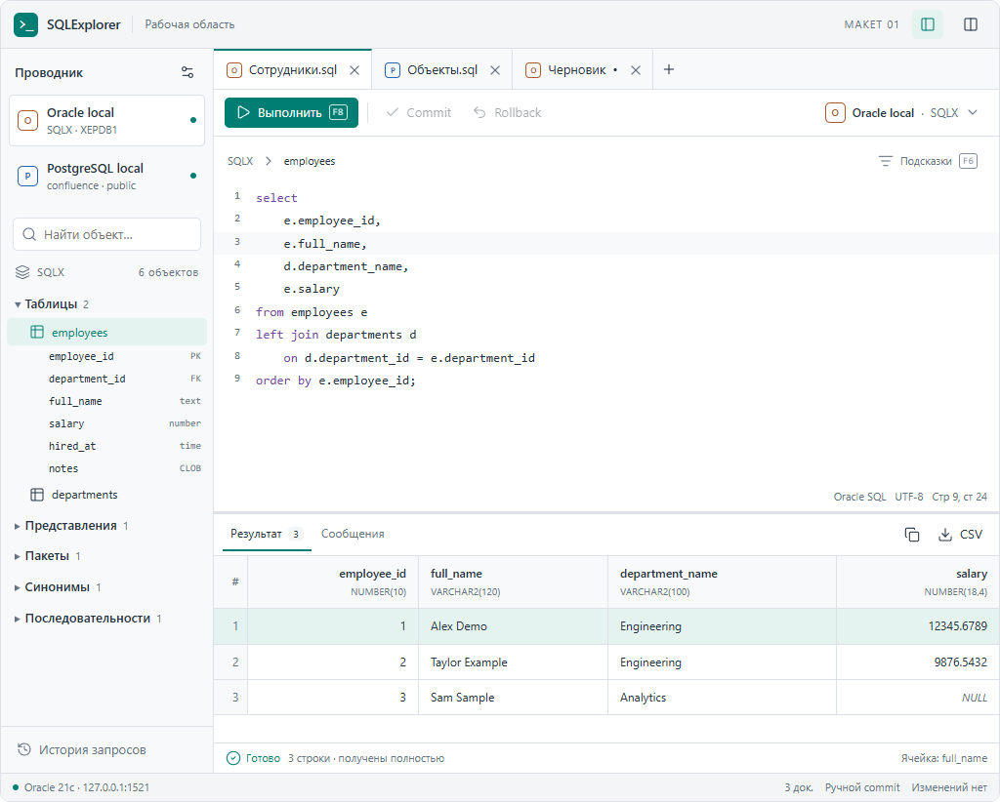
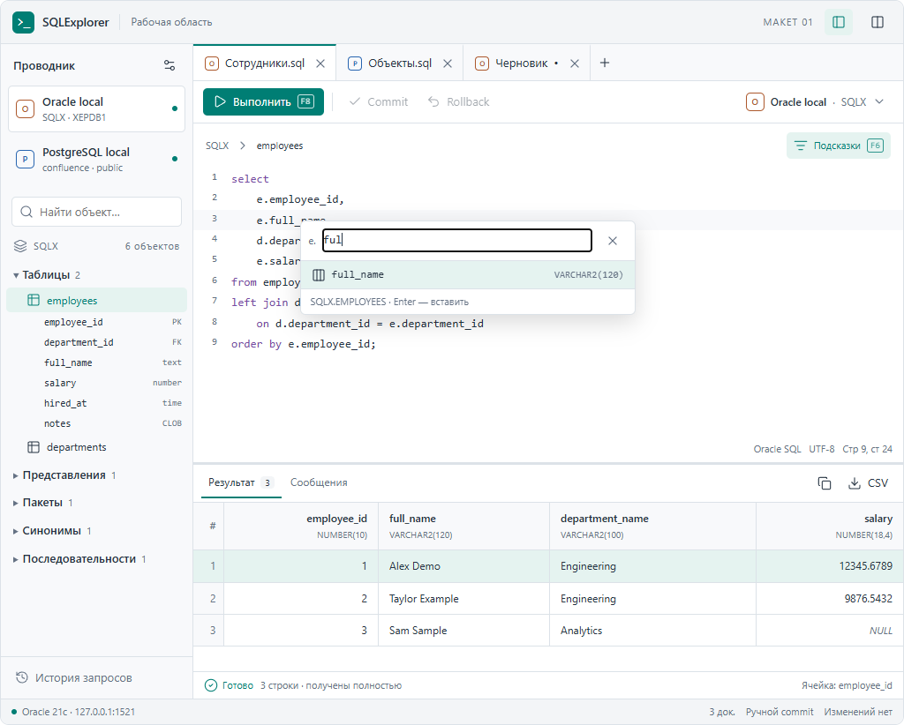
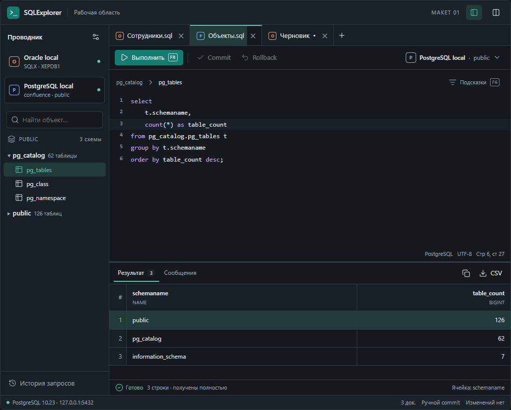
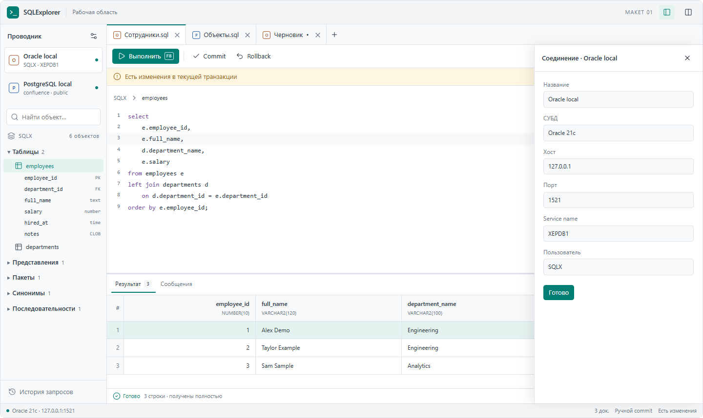
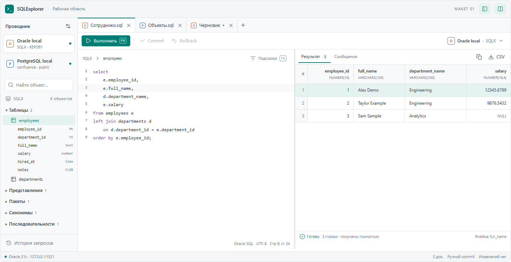

# Макет рабочего экрана SQLExplorer

Дата: 2026-09-09. Версия: 01. Статус: предложение для обсуждения; пользователь ещё не выбрал окончательное оформление.

Актуальные утверждённые доработки и варианты, требующие решения, ведутся в [едином бэклоге](backlog.md); этот документ остаётся описанием исходного макета.

Связанные документы: [архитектура](architecture.md), [автодополнение](autocompletion.md), [производительность](performance.md).

## Направление

Компактный настольный интерфейс для ежедневной работы с SQL. Проводник соединений и объектов расположен слева; SQL-документы открыты во вкладках; результат относится к конкретному документу. В основном варианте таблица находится под редактором. Светлая и тёмная темы используют одинаковую компоновку.

Высота командных панелей ограничена: основное место занимают текст и данные. Имя соединения видно рядом с выполнением, диалект обозначен во вкладке буквой O/P и цветом. Ошибки и состояния выполнения относятся к соответствующему результату. Параметры открываются в боковой панели рабочего пространства.

## Области экрана и поведение

| Область | Предлагаемое поведение |
|---|---|
| Проводник слева | Профили подключения, фильтр объектов, схемы, таблицы, колонки и программные объекты |
| SQL-вкладки | Название документа, метка диалекта, признак несохранённого текста, создание и закрытие |
| Панель выполнения | Выполнить/Остановить, Commit/Rollback, постоянное обозначение соединения документа |
| Редактор | Номера строк, подсветка, подсказки у текста, диалект и позиция курсора |
| Результат | Колонки с типами, явный NULL, сохранение точных значений, выбор ячейки, копирование и CSV |
| Состояние результата | Выполняется/Готово/Отменено, число полученных строк, признак результата предыдущего запуска |
| Нижняя строка | Сервер активного документа, число документов, ручной commit и состояние изменений |
| Боковая панель справа | Параметры соединения, сведения об объекте, история и предпросмотр копирования/экспорта |

Выбор профиля в проводнике меняет дерево объектов и контекст создания новой SQL-вкладки. Он не переназначает соединение уже открытого документа. Переключение документа возвращает его контекст; результат фонового выполнения прикрепляется к исходному документу.

Закрытые документы доступны из истории в пределах текущего макета. Поведение сохранения файлов и восстановления после перезапуска определяется архитектурой приложения; браузерный макет не сохраняет рабочую область на диск.

## Автодополнение

Предлагаются список подходящих объектов, фильтрация по введённому префиксу, тип справа и источник внизу списка. Основные действия доступны с клавиатуры: F6 открывает список, Enter выбирает вариант, Escape закрывает. В окончательном редакторе список должен следовать за позицией ввода; отдельное поле фильтра в макете позволяет посмотреть варианты без реализации редактора.

Списки подготовлены для демонстрации. Выбор варианта меняет показанный SQL; после изменения текста сохранённый результат отмечается как относящийся к предыдущему запуску. Это проверка поведения макета, а не качества Bytebase, LSP или другого движка.

## PostgreSQL и тёмная тема

Вторая вкладка показывает запрос к `pg_catalog.pg_tables`. Числа 126/62/7 получены чтением каталогов разрешённого пользователем тестового сервера. Они сохранены в макете как снимок данных, без живого подключения. Имена и значения Oracle взяты из учебной схемы SQLX.

## Соединение и транзакция

Контекст выполнения постоянно видим в рабочей области. При наличии изменений появляется компактная полоса, а Commit/Rollback становятся доступны. Параметры соединения показаны в панели справа; пароли в макет не включены.

Обычный просмотр параметров не блокирует другие документы. Взаимодействие при смене соединения с открытой транзакцией требует отдельного решения; текущий макет показывает просмотр параметров, а не реализует такую смену.

## Альтернативы

| Вариант | Выгода | Ограничение |
|---|---|---|
| Результаты снизу — основной | Достаточная ширина для SQL и широких таблиц, привычное вертикальное чтение | Меньше строк одновременно видно в редакторе и результате |
| Результаты справа | Больше высоты для текста и таблицы на широком мониторе | Делит доступную ширину; длинные SQL-строки и широкие результаты требуют больше места |
| Скрытый проводник | Больше пространства текущему документу | Навигацию по объектам нужно временно возвращать |

Рекомендация: результаты снизу по умолчанию, положение справа и скрытие проводника — настройки рабочей области. Светлая/тёмная темы и плотность строк не меняют модель документов.

Интерактивная версия позволяет сравнить положение результата, видимость проводника, плотность таблицы, тему и высоту редактора. Отдельная настройка демонстрирует наличие изменений в транзакции. Это варианты для выбора пользователем; окончательными требованиями все настройки автоматически не становятся.

## Границы макета и проверка

Макет не подключается к БД и не исполняет SQL. Выполнение, отмена и транзакции показывают заранее подготовленные состояния. Время демонстрационного перехода не является измерением производительности. Текст показан без Monaco; полноценное редактирование, драйверы, живые подсказки, секреты, сохранение файлов и настоящий экспорт не реализованы.

Проверены переключение контекста документов, независимость выбора профиля в проводнике, создание вкладки для выбранного профиля, фильтр/вставка подсказки, возврат результата к исходной вкладке, демонстрация отмены, просмотр соединения, предпросмотр CSV и восстановление закрытого документа. Привязки настроек оформления и состояние Commit/Rollback проверены в локальной проверочной среде.

Компоновка просмотрена при ширине 1024, 736 и 360 пикселей в обеих темах; альтернативное расположение справа и боковая панель — при 1440 пикселях. Горизонтальное перемещение допускается внутри широкой таблицы. Адаптация узкого просмотра нужна для обсуждения в задаче и не означает включение мобильного приложения в целевой продукт.

Следующий предмет обсуждения — плотность интерфейса, расположение результатов и достаточность постоянно видимых действий. Настоящие движки автодополнения проверяет ассистент отдельно; пользователь оценивает поведение приложения на практике после появления рабочей сборки.
